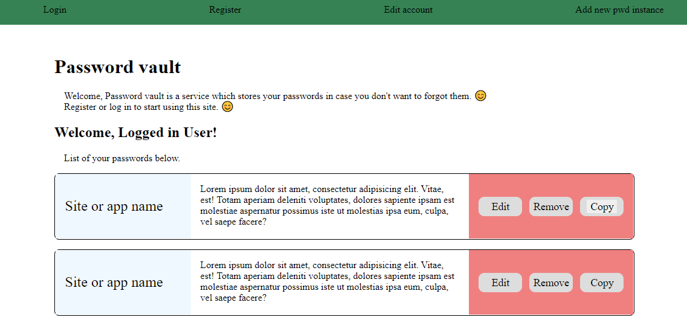
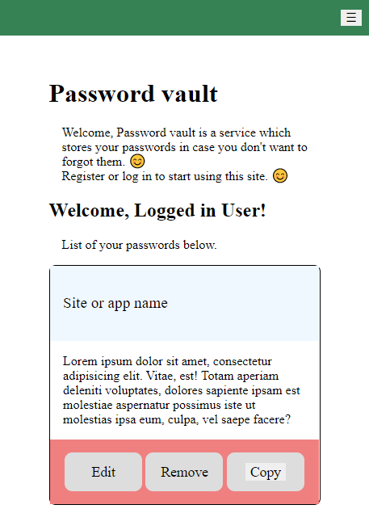

# Password vault template 
Frontend written for my simple django app.  
Coded separately for training purposes.  

## Setup
1. Download repository  
2. Make sure you have node.js installed. You can do this by typing in cmd
```
npm --version
```
3. Download all npm dev dependecies by typing
```
npm install
```
4. Run gulp
```
gulp
```
5. Open browser and go into url showed by gulp in cmd.  

## Screenshots 
Html pages example screens listed below.  
1. Index page  
  


2. Index page on mobile  
  
